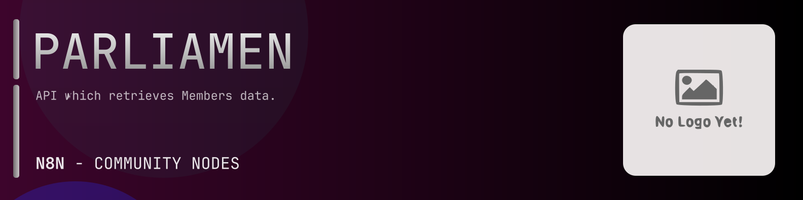

# @n8n-dev/n8n-nodes-parliament-members



[](https://www.npmjs.com/package/@n8n-dev/n8n-nodes-parliament-members)
[](https://opensource.org/licenses/MIT)

---

**Stop writing parliament-members API integrations by hand.**

Every time you connect n8n to parliament-members, you waste hours mapping endpoints, defining parameters, and debugging schemas. You copy-paste from docs, fix edge cases, and pray nothing breaks.

**What if connecting n8n to parliament-members took 5 minutes, not half a day?**

This node gives you **6+ resources** out of the box: **Location**, **Lords Interests**, **Members**, **Parties**, **Posts**, and 1 more: with full CRUD operations, typed parameters, and zero manual configuration.

---

## What You Get

- **Zero boilerplate**: Resources, operations, and fields are pre-configured and ready to use
- **Full CRUD**: Create, read, update, and delete support where the API allows it
- **Typed parameters**: No more guessing field types
- **Built-in auth**: API key authentication, ready to go
- **Declarative**: Native n8n performance, no custom execute() overhead

---

## Install

```bash
npm install @n8n-dev/n8n-nodes-parliament-members
```

**Or in n8n:**
1. **Settings → Community Nodes → Install**
2. Search: `@n8n-dev/n8n-nodes-parliament-members`
3. Click **Install**

---

## Quick Start

1. Install the node (above)
2. Add credentials: **parliament-members API** → paste your API key
3. Drag the **parliament-members** node into your workflow
4. Pick a resource → pick an operation → done.

That's it. No configuration files. No code. It just works.

---

## Resources

| Resource | Operations |
|----------|------------|
| Location | Get returns a list of locations both parent and child, Get returns a list of constituencies, Get returns a constituency by id, Get returns latest election result by constituency id, Get returns an election result by constituency and election id, Get returns a list of election results by constituency id, Get returns geometry by constituency id, Get returns a list of representations by constituency id, Get returns a synopsis by constituency id |
| Lords Interests | Get returns a list of registered interests, Get returns a list of staff |
| Members | Get return members by id with list of their historical names parties and memberships, Get returns a list of current members of the commons or lords, Get returns a list of members of the commons or lords, Get return member by id, Get return biography of member by id, Get return list of contact details of member by id, Get return contribution summary of member by id, Get return list of early day motions of member by id, Get return experience of member by id, Get return list of areas of focus of member by id, Get return latest election result of member by id, Get return portrait of member by id, Get return portrait url of member by id, Get return list of registered interests of member by id, Get return list of staff of member by id, Get return synopsis of member by id, Get return thumbnail of member by id, Get return thumbnail url of member by id, Get return list of votes by member by id, Get return list of written questions by member by id |
| Parties | Get returns a list of current parties with at least one active member, Get returns the composition of the house of lords by peerage type, Get returns current state of parties |
| Posts | Get returns a list of departments, Get returns a list of government posts, Get returns a list of opposition posts, Get returns a list containing the speaker and deputy speakers, Get returns a list of spokespersons |
| Reference | Get returns a list of answering bodies, Get returns a list of departments, Get returns department logo, Get returns a list of policy interest |

---

## Why This Node?

**Without this node:**
- Hours of manual API integration
- Copy-pasting from parliament-members docs
- Debugging auth, pagination, error handling
- Maintaining your own client code

**With this node:**
- Install → configure → use. 5 minutes.
- Auto-generated from the official parliament-members OpenAPI spec
- Always up to date when the API changes
- Native n8n performance

---

## Auto-Generated
This node was auto-generated from the official **parliament-members** OpenAPI specification using
[@n8n-dev/n8n-openapi-node-ultimate](https://github.com/kelvinzer0/n8n-openapi-node-ultimate),
then validated against the live API so you get accurate types and real parameters, not guesswork.

When the parliament-members API updates, this node updates too.

---

## Support This Project

If this node saved you hours of work, consider supporting continued development, new APIs, better error handling, and faster updates.

[](https://n8n-code.github.io/membership/#/eyJ0aXRsZSI6IktlZXAgSXQgTW92aW5nIiwiZGVzYyI6Ik9uZSBkZXZlbG9wZXIgYnVpbHQgYSB0b29sIHRoYXQgYXV0by1nZW5lcmF0ZXNcbm44biBub2RlcyBmcm9tIGFueSBPcGVuQVBJIHNwZWMuXG5cbllvdXIgZG9uYXRpb24gZnVuZHMgbmV3IGZlYXR1cmVzLCBtb3JlIEFQSSBzdXBwb3J0LFxuYW5kIGJldHRlciB0b29saW5nIGZvciBldmVyeSBkZXZlbG9wZXIgYWZ0ZXIgeW91LiIsInRhcmdldCI6NTAwMCwiYWRkcmVzc2VzIjp7ImV0aGVyZXVtIjoiMHhmMDU1NWQ0MGRiRkI0ZTNCZjA3MDQ0MjgyQjc4RjJmRTFmNTFFZjcyIiwic29sYW5hIjoiNlpEVk5BYmpZZExEcXo4cGt3VUNHYllaNVV3QlFranB0QzU1Wk5vTFcybVUifSwiZGlzY29yZCI6Imh0dHBzOi8vZGlzY29yZC5nZy9wdERaOGU0aDkzIn0)

---

## License

MIT © [kelvinzer0](https://github.com/n8n-code)
